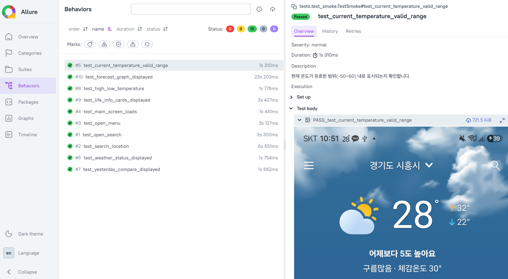
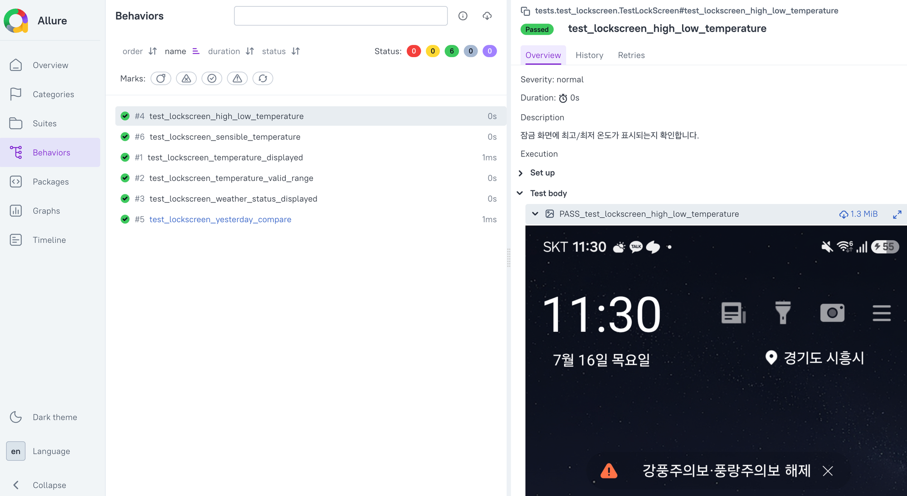

# 첫화면 날씨 - Android UI 자동화 테스트

"첫화면 날씨" 앱을 대상으로 한 Android UI 자동화 테스트 프로젝트입니다.

## 앱 정보

| 항목 | 내용 |
|------|------|
| 앱명 | 첫화면 날씨 - 위젯, 미세먼지, 날씨 |
| 패키지명 | `weather.forecast.rain.radar` |
| 앱 구조 | Jetpack Compose + 전통 Android View + WebView(광고) 혼합 |

## 기술 스택

| 항목 | 기술 |
|------|------|
| 언어 | Python 3.14 |
| 프레임워크 | Appium 3.3.0 (UiAutomator2) |
| 테스트 러너 | pytest |
| 리포트 | Allure Report |
| 디자인 패턴 | Page Object Model (POM) |
| 잠금 화면 검증 | adb + uiautomator dump |

## 프로젝트 구조

```
tnear-weather/
├── conftest.py                 # 드라이버 세션 관리, 테스트 격리, Allure 스크린샷 첨부
├── pytest.ini
├── requirements.txt
├── config/
│   └── android_caps.json       # Android Capabilities
├── pages/                      # Page Object Model
│   ├── base_page.py            # 공통 액션 (find, scroll, swipe)
│   ├── main_page.py            # 메인 화면 (날씨, 생활정보, 단기예보)
│   ├── search_page.py          # 검색 화면
│   └── settings_page.py        # 설정 화면
├── tests/
│   ├── test_smoke.py           # 핵심 기능 검증 (6개)
│   ├── test_weather.py         # 단기예보 검증 (1개)
│   ├── test_search.py          # 검색 기능 검증 (2개)
│   ├── test_settings.py        # 메뉴 진입 검증 (1개)
│   └── test_lockscreen.py      # 잠금 화면 날씨 검증 (6개, adb 기반)
├── utils/
│   ├── driver_factory.py       # Appium 드라이버 생성
│   └── adb_helper.py           # adb 유틸리티 (잠금 화면 검증용)
└── docs/
    └── allure-report.png       # Allure 리포트 캡처
```

## 테스트 케이스 (16개)

### Smoke - 메인 화면 핵심 기능 (6개, Appium)

| 테스트 | 검증 내용 |
|--------|----------|
| test_main_screen_loads | 현재 날씨 정보 영역 로딩 확인 |
| test_current_temperature_valid_range | 온도가 유효 범위(-50~60도) 내인지 검증 |
| test_weather_status_displayed | 날씨 상태 + 체감온도 표시 확인 |
| test_yesterday_compare_displayed | 어제 대비 온도 비교 정보 표시 확인 |
| test_high_low_temperature | 최고/최저 온도 표시 확인 |
| test_life_info_cards_displayed | 미세먼지/바람/습도/강수확률 카드 표시 및 값 유효성 확인 |

### Weather - 단기예보 (1개, Appium)

| 테스트 | 검증 내용 |
|--------|----------|
| test_forecast_graph_displayed | 단기예보 그래프 표시 확인 |

### Search - 지역 검색 (2개, Appium)

| 테스트 | 검증 내용 |
|--------|----------|
| test_open_search | 검색 화면 진입 및 입력창 표시 확인 |
| test_search_location | 지역명 검색 동작 확인 |

### Settings - 메뉴 (1개, Appium)

| 테스트 | 검증 내용 |
|--------|----------|
| test_open_menu | 메뉴 바텀시트 진입 확인 |

### Lock Screen - 잠금 화면 날씨 (6개, adb)

| 테스트 | 검증 내용 |
|--------|----------|
| test_lockscreen_temperature_displayed | 잠금 화면 현재 온도 표시 확인 |
| test_lockscreen_temperature_valid_range | 잠금 화면 온도 유효 범위(-50~60도) 검증 |
| test_lockscreen_weather_status_displayed | 잠금 화면 날씨 상태 표시 확인 |
| test_lockscreen_high_low_temperature | 잠금 화면 최고/최저 온도 표시 확인 |
| test_lockscreen_yesterday_compare | 잠금 화면 어제 대비 온도 비교 확인 |
| test_lockscreen_sensible_temperature | 잠금 화면 체감온도 표시 확인 |

## 테스트 결과

### 앱 테스트 (Appium)


### 잠금 화면 테스트 (adb)


- 앱 테스트 10개 + 잠금 화면 테스트 6개 = 전체 16개 PASS
- 각 테스트별 실행 스크린샷 자동 첨부 (성공/실패 모두)

## Locator 전략

이 앱은 Jetpack Compose와 전통 Android View가 혼합되어 있어 영역별로 다른 locator 전략을 적용했습니다.

| 영역 | UI 프레임워크 | locator 방식 |
|------|-------------|-------------|
| 현재 날씨, 앱바 | Compose | `content-desc` 기반 (`ACCESSIBILITY_ID`, `descriptionContains`) |
| 생활정보 카드, 주간날씨 | 전통 View | `resource-id` 기반 (`AppiumBy.ID`) |
| 잠금 화면 날씨 | 전통 View | `resource-id` 기반 (`adb uiautomator dump`) |

## 자동화 접근 방식

### 앱 내부 (Appium + UiAutomator2)
앱이 포그라운드에 있는 상태에서 Appium 세션으로 UI 요소를 조작하고 검증합니다.

### 잠금 화면 (adb + uiautomator dump)
이 앱은 잠금 화면에 자체 Activity(`ScreenActivity`)를 띄워 날씨를 표시합니다.
Appium 세션으로는 접근할 수 없지만, adb로 화면을 끄고 켠 뒤 `uiautomator dump`로 UI XML을 파싱하여 검증합니다.

> 앱 테스트와 잠금 화면 테스트는 충돌 방지를 위해 별도로 실행합니다.

## 자동화 한계

| 영역 | 사유 |
|------|------|
| 홈 화면 위젯 | 런처 위의 위젯은 앱 컨텍스트 밖 |
| 푸시 알림 (태풍/특보) | 서버 트리거, 발생 시점 제어 불가 |
| 날씨 애니메이션 | UI 트리에 렌더링 결과가 잡히지 않음 |
| AOD (Always On Display) | 시스템 레벨 기능 |
| 광고 배너 | 외부 광고 서버 의존, 내용 매번 변경 |
